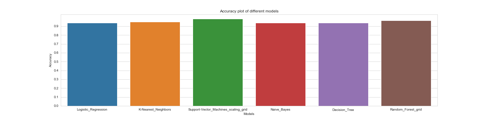
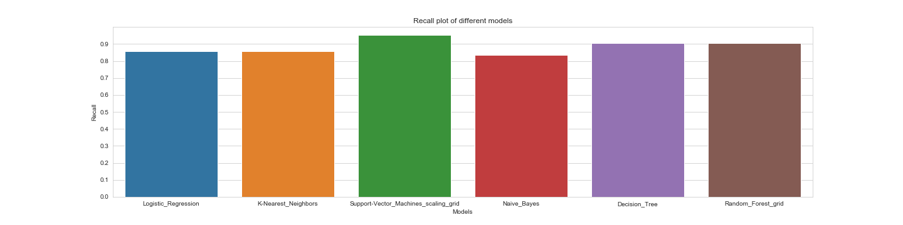
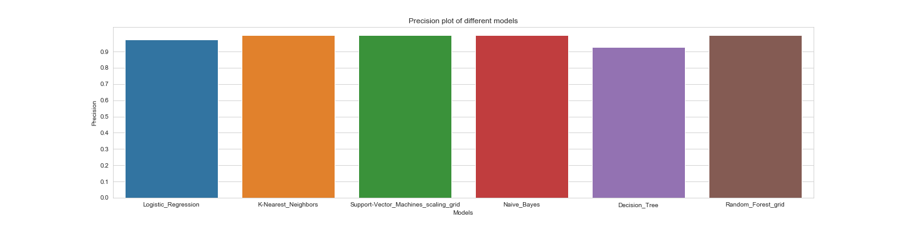
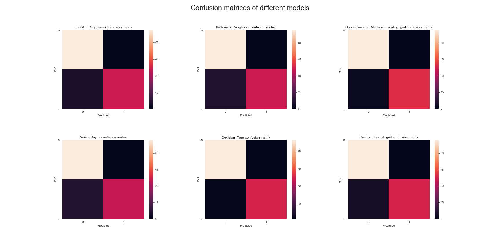

# Overview
Machine Learning classification task to predict if a breast cancer is benign or malignant.

In the notebook you can:
- get a first insight of the dataset
- see all the steps needed for preparing the data for the algorithms
- look at the training of different models
- observe a final comparison between them

# Goals and metrics
In the notebook and in the /res/plots/ folder it's possible to observe more of results/metrics of the project; below are reported some of these.

N.B.: it's possible to find some suffix in the model names:
- "scaling" means that features have been scaled for that model
- "grid" means that a grid search has been performed on that model
### Accuracy

### Recall

### Precision

### ROC_AUC

### Confusion matrices

# Dataset
https://www.kaggle.com/uciml/breast-cancer-wisconsin-data
